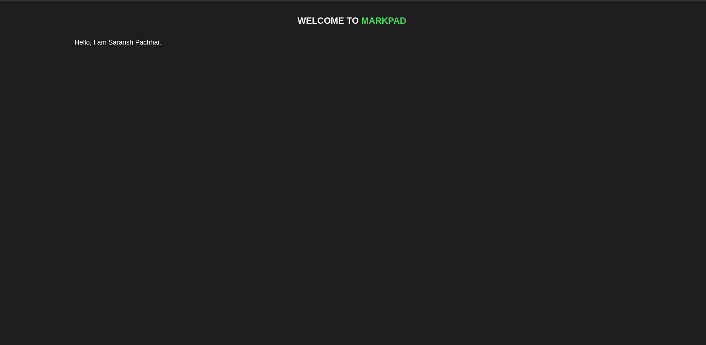

# MarkPad

A distraction-free notepad Chrome extension with Markdown support. Write notes quickly and efficiently in every new tab.

## Features

- **Markdown Support**: Write in Markdown and see it rendered in real-time.
- **Checkboxes**: Create interactive checkboxes (`[ ]` and `[x]`).
- **Auto-Save**: Your notes are automatically saved.
- **Minimal Design**: Focus on your notes without distractions.

## How to Use

1. Clone this repository.
2. Load the extension in Chrome:
   - Go to `chrome://extensions/`.
   - Enable "Developer mode".
   - Click "Load unpacked" and select the `MarkPad` folder.
3. Open a new tab to start using MarkPad.

## Screenshots

## License

This project is licensed under the MIT License. See the [LICENSE](LICENSE) file for details.
